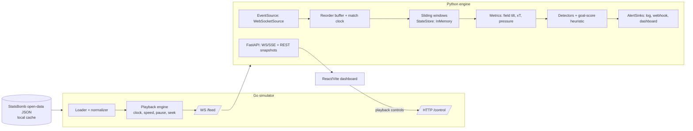

# Project Plan & Roadmap

This is the implementation roadmap for the Live Football Analytics Stream. The product vision is in [`copilot_context.md`](copilot_context.md), and the decisions taken so far are recorded in its **Decisions** section.

## Goals
- **Portfolio piece** that shows streaming, data engineering and cloud skills.
- **Personal tool** for watching match replays with live analytics.
- **Product prototype** that could later take a real live data feed.
- **Learning Go**, alongside Python and TypeScript.

## Approach
A phased build in three languages:

- **Go stream simulator** replays StatsBomb open data as a live WebSocket feed, with pause, resume, speed and seek.
- **Python analytics engine** computes rolling-window metrics and heuristic alerts.
- **React + Vite dashboard** shows metrics and alerts live.

The engine works through three interfaces: `EventSource`, `StateStore` and `AlertSink`. Because the code only depends on these, a broker (Phase 2), trained models (Phase 3) and cloud deployment (Phase 4) can be added later without rewrites.

## Architecture (Phase 1)



### Repository layout

```
schema/        JSON Schemas for events, controls, metrics, alerts (single source of truth) + fixtures/
simulator/     Go module: cmd/simulator, internal/{loader,playback,clock,server}
engine/        Python package (uv): sources/, clock/, windows/, metrics/, detectors/, sinks/, api/
dashboard/     React + Vite + TypeScript
data/          gitignored local cache of StatsBomb files (fetched by script)
scripts/       data fetch, xT grid computation, backtests
infra/         Bicep modules + parameter files (Phase 4)
docs/          this plan, architecture notes, metric definitions
Makefile       gen, dev, test, lint, run-all targets
.github/workflows/ci.yml
```

## Key design rules
- **Match time, not wall-clock.** Windows, metrics and alerts are based on match time (period + game clock), so results are identical at any playback speed and after a seek.
- **Canonical event schema.** The simulator converts StatsBomb events into a slim format: `id`, `match_id`, `offset`, `period`, `match_clock_s`, `type`, `team`, `player`, `location`, `end_location`, `outcome`, `possession_id`, plus `schema_version`. The JSON Schemas in `schema/` are the single source of truth.
  - Types are generated for each language:
    - Python: pydantic, via `datamodel-code-generator`
    - TypeScript: via `json-schema-to-typescript`
    - Go: via `go-jsonschema`, with hand-written structs as a fallback
  - Shared example messages in `schema/fixtures/` are validated by the tests in all three languages.
  - Raw StatsBomb JSON never leaves the simulator, which keeps the boundary clean for a future live provider.
- **Events behave like a broker log.**
  - Every event has a stable `id` and a per-match sequence `offset`.
  - `EventSource` supports `subscribe(from_offset)` and `seek(offset)`.
  - Processing is safe to repeat: duplicates are dropped by `id`.
  - Everything is keyed by `match_id`, which becomes the broker partition key later.
  - The WebSocket feed sends one JSON event per message, and clients resume after a disconnect with `?from_offset=N`.
- **Out-of-order safety.** The engine holds events in a small reorder buffer with a watermark, which sets how late (in match seconds) an event may arrive and still be accepted. The simulator's `--jitter` mode shuffles events slightly to test this.
- **Seek semantics.**
  1. When playback seeks, the simulator sends a `reset` control message.
  2. The engine discards its window state.
  3. It then rebuilds that state by fast-replaying from offset 0 up to the target time.
- **One match at a time in v1.** All state, topics and APIs are still keyed by `match_id`, so several matches can be supported later.
- **No database in v1.** Alerts go to the log sink. Storage is added only when there's a need.
- **Attribution and licensing.**
  - StatsBomb data is never committed, and their open data terms (including attribution) are followed.
  - The xT grid source is credited.

## Metric definitions (v1)
- **Field tilt (per window):** each team's share of attacking-third touches (passes, carries, receptions, shots) in the window.
- **xT added:** for each successful pass or carry, `xT(end_cell) − xT(start_cell)` on a 12×8 grid, summed per team per window. **xT velocity** is xT added per match minute.
  - The grid starts as Karun Singh's published one; in Phase 3 we compute our own and compare.
- **Sustained pressure index:** a weighted sum of:
  - recoveries in the attacking half
  - box entries
  - shots
  - consecutive own-possession actions in the final third
  - length of possession sequences in the opponent's box

  The weights live in config.
- **Windows:** rolling 5 and 10 match-minutes, plus a whole-match baseline (an exponentially weighted mean and variance) used for anomaly detection.

## Predictive signals (v1, rule-based)
- **Momentum shift alert:** fires when the z-score of the pressure index or field tilt, measured against that team's match baseline, crosses a threshold. A cooldown stops repeat firing.
- **Goal-in-next-X-minutes score:** a logistic-shaped formula over pressure density, xT velocity and recent shots. It is labelled a *heuristic score*, not a probability, until it is calibrated in Phase 3.
- **Next-to-control/score indicator:** compares the two teams' momentum trends, using the slope of the 5-minute versus 10-minute windows.
- **Alert payload:** each alert carries `type`, `team`, `match_clock`, `value`, the contributing features, and the window.

## Roadmap

### Phase 0: Foundations
- [ ] Monorepo scaffold:
  - Go modules
  - uv + ruff + pytest + mypy
  - pnpm + Vite + eslint
  - Makefile
  - `.gitignore` (including `data/`)
- [ ] JSON Schemas + fixtures for events, controls, metrics and alerts; `make gen` generates Go, Python and TS types.
- [ ] Data fetch script for the 2022 FIFA World Cup (StatsBomb open data).
- [ ] CI that runs:
  - lint and tests for Go, Python and TS
  - fixture contract tests
  - a check that generated code is up to date

### Azure bootstrap (free, can run alongside Phase 0)
- [ ] Install the Azure CLI and sign in (Visual Studio subscription; spending limit on).
- [ ] Create resource group `rg-football-analytics-dev` in a chosen region.
- [ ] Subscription budget with email alerts.
- [ ] Connect GitHub Actions to Azure via OIDC (federated credential, least-privilege role on the resource group, no stored secrets).

### Phase 1: MVP (one match replayed end to end, with live dashboard)
- [ ] **Go simulator:**
  - loader and normalizer
  - playback: pause, resume, speed, seek
  - match clock: halves, stoppage time, extra time
  - WebSocket feed with offset-based resume
  - HTTP control API
  - `--jitter` mode
- [ ] **Engine core:**
  - `WebSocketSource`
  - reorder buffer and watermark
  - match-clock tracker
  - in-memory sliding-window `StateStore`
  - seek and reset handling
- [ ] **Metrics:** field tilt, xT (published grid) and pressure index, unit-tested on hand-built event sequences.
- [ ] **Detectors and alert routing:**
  - momentum z-score
  - goal-score heuristic
  - next-to-control indicator
  - cooldowns
  - log, webhook and dashboard sinks
- [ ] **Engine API (FastAPI):**
  - WS/SSE streams for metrics and alerts
  - REST endpoints for snapshots and the match list
  - passthrough of playback controls to the simulator
- [ ] **Dashboard (lean):**
  - match picker
  - playback controls
  - live charts: field tilt, xT, pressure
  - alert feed
  - *The pitch view comes after the MVP.*
- [ ] **End-to-end smoke test:** replay the 2022 World Cup final (Argentina vs France) at high speed and check the key metrics and alerts. For example, France's comeback around minutes 80–81 should trigger a momentum alert.

### Phase 2: Containers and broker
- [ ] Dockerfiles for all three services, plus Docker Compose.
- [ ] Redpanda-based `EventSource` and publisher:
  - uses a standard Kafka client with no Redpanda-only features, so it also works with Azure Event Hubs
  - topics keyed by `match_id`
  - seek works by rewinding the consumer offset
- [ ] Publish metrics and alerts to the broker so several services can consume them.
- [ ] CI builds the container images.
- [ ] *(Only if justified)* Redis `StateStore`, for running several engine instances or recovering after a crash.

### Phase 3: Modeling
- [ ] Compute our own xT grid from StatsBomb data and compare it with the published grid.
- [ ] Backtest harness that runs many matches offline through the engine.
- [ ] Training data: windows labelled by whether a goal follows within X minutes.
- [ ] Train logistic regression or gradient-boosted (GBM) models; evaluate with Brier score and calibration plots.
- [ ] Swap the trained model in behind the existing detector interface, and tune heuristic thresholds against the data.
- [ ] *(Optional)* A Streamlit app for exploring backtest results.

### Phase 4: Azure deployment & operations
- [ ] Bicep modules in `infra/`:
  - Container Registry (Basic)
  - Log Analytics + Application Insights
  - Key Vault
  - Container Apps: an environment plus the simulator and engine apps. The engine runs at least 1 replica, since its state is in memory, and both use WebSocket ingress.
  - Static Web Apps for the dashboard
  - Event Hubs Standard, using its Kafka endpoint
- [ ] Dashboard access control: shared password or built-in Microsoft account sign-in. Playback controls are never public.
- [ ] GitHub Actions deploy pipeline (signs in via OIDC):
  1. build the images
  2. push them to the Container Registry
  3. run `az deployment group create`
- [ ] Structured logging and OpenTelemetry tracing.
- [ ] Teardown and recreate scripts for the costly resources, to save credit. Check costs in the Azure pricing calculator first.

### Phase 5 (optional): Live provider
- [ ] Evaluate paid live feeds for how detailed their coordinates are.
- [ ] Implement `LiveProviderSource` behind the same schema.

## Open questions
- Azure region.
- Shared password or Microsoft sign-in for the dashboard (Phase 4).
- The goal window X (e.g. 5 or 10 minutes) and the alert thresholds; tune in Phase 3.
- Whether generated code is committed or generated in CI.
- Whether a more compact wire format is worth it on the broker (unlikely at this scale).
