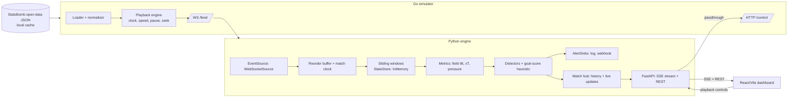
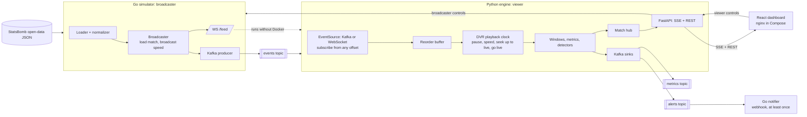

# Project Plan & Roadmap

This is the implementation roadmap for the Live Football Analytics Stream. The product vision is in [`copilot_context.md`](copilot_context.md), and the decisions taken so far are recorded in its **Decisions** section.

## Goals
- **Portfolio piece** that shows streaming, data engineering and cloud skills.
- **Personal tool** for watching match replays with live analytics.
- **Product prototype** that could later take a real live data feed.
- **Learning Go**, alongside Python and TypeScript.

## Approach
A phased build in three languages:

- **Go stream simulator** broadcasts StatsBomb open data as a live WebSocket feed, like a live provider: each match once, in order, at a chosen speed.
- **Python analytics engine** computes rolling-window metrics and heuristic alerts.
- **React + Vite dashboard** shows metrics and alerts live.

The engine works through three interfaces: `EventSource`, `StateStore` and `AlertSink`. Because the code only depends on these, a broker (Phase 2), trained models (Phase 3) and cloud deployment (Phase 4) can be added later without rewrites.

## Architecture (Phase 1)


```mermaid
flowchart LR
  SB[(StatsBomb open-data JSON<br/>local cache)] --> SIM
  subgraph SIM[Go simulator]
    L[Loader + normalizer] --> P[Playback engine<br/>clock, speed, pause, seek]
    P --> WS[/WS /feed/]
    C[/HTTP /control/]
  end
  WS --> ENG
  subgraph ENG[Python engine]
    SRC[EventSource: WebSocketSource] --> RB[Reorder buffer + match clock]
    RB --> WIN[Sliding windows<br/>StateStore: InMemory]
    WIN --> MET[Metrics: field tilt, xT, pressure]
    MET --> DET[Detectors + goal-score heuristic]
    DET --> SINK[AlertSinks: log, webhook]
    DET --> HUB[Match hub: history + live updates]
    HUB --> API[FastAPI: SSE stream + REST]
  end
  API -- SSE + REST --> UI[React/Vite dashboard]
  UI -- playback controls --> API
  API -- passthrough --> C
```

### Repository layout

```
schema/        jsonschema/ (single source of truth for events, controls, metrics, alerts, engine status) + fixtures/{valid,invalid}/
simulator/     Go module: cmd/simulator, internal/{statsbomb,match,jitter,broadcast,server,schema}
engine/        Python package (uv): sources/, clock/, windows/, metrics/, detectors/, sinks/, api/
dashboard/     React + Vite + TypeScript
data/          gitignored local cache of StatsBomb files (fetched by script)
scripts/       data fetch, xT grid computation, backtests
infra/         Bicep modules + parameter files (Phase 4)
docs/          this plan, architecture notes, metric definitions
Makefile       gen, dev, test, lint, run-all targets
.github/workflows/ci.yml
```

From Phase 2 there is also `notifier/` (a Go module: `alerts` topic → webhook), a Dockerfile in each service's directory, and `compose.yaml` at the root.

## Architecture (Phase 2 target)


```mermaid
flowchart LR
  SB[(StatsBomb open-data JSON)] --> SIM
  subgraph SIM[Go simulator: broadcaster]
    L[Loader + normalizer] --> B[Broadcaster<br/>load match, broadcast speed]
    B --> WS[/WS /feed/]
    B --> PROD[Kafka producer]
  end
  PROD --> TE[[events topic]]
  TE --> ENG
  WS -. runs without Docker .-> ENG
  subgraph ENG[Python engine: viewer]
    SRC[EventSource: Kafka or WebSocket<br/>subscribe from any offset] --> RB[Reorder buffer]
    RB --> DVR[DVR playback clock<br/>pause, speed, seek up to live, go live]
    DVR --> MD[Windows, metrics, detectors]
    MD --> HUB[Match hub] --> API[FastAPI: SSE + REST]
    MD --> PUB[Kafka sinks]
  end
  PUB --> TM[[metrics topic]]
  PUB --> TA[[alerts topic]]
  TA --> NOT[Go notifier<br/>webhook, at least once]
  API -- SSE + REST --> UI[React dashboard<br/>nginx in Compose]
  UI -- viewer controls --> API
  API -- broadcaster controls --> SIM
```

## Key design rules
- **Match time, not wall-clock.** Windows, metrics and alerts are based on match time (period + game clock), so results are identical at any playback speed and after a seek.
- **Canonical event schema.** The simulator converts StatsBomb events into a slim format: `id`, `match_id`, `offset`, `period`, `match_clock_s`, `type`, `team`, `player`, `location`, `end_location`, `outcome`, `possession_id`, plus `schema_version`. The JSON Schemas in `schema/jsonschema/` are the single source of truth.
  - Types are generated for each language:
    - Python: pydantic, via `datamodel-code-generator`
    - TypeScript: via `json-schema-to-typescript`
    - Go: via `go-jsonschema` (generated `UnmarshalJSON` also enforces the schema constraints)
  - Generated code is committed, and CI fails if `make gen` would change it.
  - Shared example messages in `schema/fixtures/` (valid and invalid) are checked by the tests in all three languages.
  - Raw StatsBomb JSON never leaves the simulator, which keeps the boundary clean for a future live provider.
- **Events behave like a broker log.**
  - Every event has a stable `id` and a per-match sequence `offset`.
  - `EventSource` has one method, `subscribe(from_offset)`. Seeks need no method of their own: the engine's DVR replays from its own copy of the match (see *Seek semantics*), and only a restarted engine subscribes again from offset 0.
  - Processing is safe to repeat: duplicates are dropped by `id`.
  - Everything is keyed by `match_id`, which becomes the broker partition key later.
  - The WebSocket feed sends one JSON event per message, and clients resume after a disconnect with `?from_offset=N`.
  - On Kafka (from Phase 2), the `events` topic carries the same JSON messages, keyed by `match_id`: each broadcast match is a `match_start` (without `head`), its events, and a `match_end`, so a match is a contiguous run on one partition. The engine commits no offsets: it finds the latest `match_start`, catches up from it, and follows the next one. Topics are created by deployment (a Compose job, IaC in the cloud), not by the apps. Client settings are `KAFKA_*` environment variables mapped to librdkafka properties, the same in Go and Python.
- **Out-of-order safety.** The engine holds events in a small reorder buffer with a watermark, which sets how late (in match seconds) an event may arrive and still be accepted (`--allowed-lateness`, default 5s). Events behind the watermark are dropped and counted, not patched in. The simulator's `--jitter` mode shuffles events slightly to test this.
- **Windows run on play time.** Periods are joined end to end (each starts where the previous one's last event was), so a 5-minute window runs smoothly across half-time. `--window-mode per_period` restarts windows at each kick-off instead. Penalty shootout events are left out of windows.
- **Seek semantics.**
  - *Phase 1:* when playback seeks, the simulator sends a `reset` control message. The engine discards its window state, then rebuilds it by fast-replaying from offset 0 up to the target time.
  - *From Phase 2:* the simulator is a broadcaster. Like a live provider, it publishes each match once, in order, and never seeks; its controls are load, play, pause and speed. The engine is the viewer, a DVR (`engine.dvr`):
    - it keeps the current match's feed in memory, in arrival order, so a seek never goes back to the source. That works for push-only providers too, and replays exactly what was received, jitter included;
    - a seek back starts the match over from that copy, rebuilds up to the target time without sending alerts, and plays on from there at the viewer's speed; a seek forward fast-forwards through the copy;
    - it can't seek past the live edge (what has been received so far): a later target goes live. Playing to the end of the copy goes live too, and "go live" catches up at once;
    - viewer controls are `POST /api/control` (play, pause, speed, seek, go live); broadcaster controls pass through `/api/broadcast`. The status reports the viewer's state, the live edge, and how far behind it the viewer is in play time;
    - the two are never merged: the viewer's controls work on any feed, while the broadcaster's only exist because the simulator stands in for one. The engine runs without a simulator (`--no-simulator`, Kafka only), as it will on a real feed; its broadcast endpoints then answer 404 and the dashboard hides its simulator panel;
    - a new match from the source restarts the DVR live. On a reconnect, the broadcaster resends the match from offset 0 if the engine asks for more than it has published (e.g. after a broadcaster restart), and the engine starts over.
- **Only the DVR uses the wall clock** (from Phase 2). The engine's playback clock releases each event when playback reaches its match time, at the viewer's speed. Windows, metrics and detectors still see only match time.
- **Catch-up is a replay too.** Each `match_start` carries the feed's `head`, the number of events already published. When the engine connects or reconnects mid-match, it rebuilds state from those events without sending alerts for them.
- **One match at a time in v1.** All state, topics and APIs are still keyed by `match_id`, so several matches can be supported later.
- **No database in v1.** Alerts go to the log and, with `--webhook URL`, are POSTed as JSON. Storage is added only when there's a need.
- **Sinks never hold up the match.** An `AlertSink` takes each alert without blocking. The webhook sink queues alerts for a background worker, which retries network failures, server errors and 429s with exponential backoff; other 4xx errors are not retried. A full queue drops the alert with a warning.
- **Attribution and licensing.**
  - StatsBomb data is never committed, and their open data terms (including attribution) are followed.
  - The xT grid source is credited.

## Metric definitions (v1)
Every metric is a pure function of the events in a window, recomputed on demand rather than updated event by event. That keeps them easy to test on hand-built sequences, and identical after a seek. Locations are on StatsBomb's 120×80 pitch, with each event oriented so the acting team attacks towards x=120.

- **Field tilt (per window):** each team's share of attacking-third (x ≥ 80) touches in the window. Touches are passes, carries, successful receptions and shots. With no touches, both teams get 50%.
- **xT added:** for each completed pass or carry (outcome not failed, both locations known), `xT(end_cell) − xT(start_cell)` on a 12×8 grid, summed per team per window. **xT velocity** is xT added per minute of play actually covered by the window, with a floor of 1 minute, so a window that is still filling up early in a match is not under-reported.
  - The grid is Karun Singh's published one. It has no licence, so `make fetch-data` downloads it to `data/xt/` and it is never committed. In Phase 3 we compute our own and compare.
- **Sustained pressure index:** a weighted sum of five counts (default weights in brackets):
  - recoveries (successful ball recoveries and interceptions) in the attacking half (1.0);
  - box entries: completed passes or carries from outside the opponent's box into it (1.5);
  - shot value: 1 + xG per shot (2.0);
  - sustained actions: own on-ball actions in own possession, in runs of 3 or more inside the final third; a possession change or an action outside the final third ends the run (0.25 per action);
  - box actions: own on-ball actions in the opponent's box, from the 2nd onwards in each possession (0.5).

  The weights are a `PressureWeights` config. They are not tuned yet (Phase 3).
- **Windows:** rolling 5 and 10 minutes of play. The whole-match baseline (an exponentially weighted mean and variance) belongs to the detectors, which are its only users.

## Predictive signals (v1, rule-based)
Detectors run on a fixed tick of play time: once every 30 seconds, on the first released event past each multiple of 30s. Penalty shootouts have no ticks. All windows below are 5 minutes of play, and the thresholds are untuned (Phase 3).

- **Momentum shift (`momentum_shift`):** a team's 5' pressure index against its own match baseline, an exponentially weighted mean and variance over play time (half-life 10 minutes). It fires when `z = (pressure − mean) / max(std, 3)` reaches 2.0. The z-score uses the baseline before the current value is added. There are no alerts in the first 15 minutes of play, while the baseline warms up.
- **Goal threat (`goal_threat`):** `sigmoid(−3 + 1.5 · pressure / 18 + 1.5 · xT velocity / 0.05)`, firing at 0.5. The scales are about the top few percent of 5' values in the 2022 final, so a team at both scores exactly 0.5. Only play since the last goal in the window counts, because a goal resets the danger. Shots count through the pressure index. It is a *heuristic score*, not a probability, until it is calibrated in Phase 3.
- **Control shift (`control_shift`):** a team's pressure balance `(own − opponent) / (own + opponent + 5)`, from −1 to 1. The `+5` keeps a quiet spell from looking like total control. It fires when the balance goes from ≤ −0.2 over the previous 5 minutes to ≥ 0.5 over the last 5, so the team that was pinned back is now on top. It needs 10 minutes of play.
- **Cooldown:** after an alert, the same detector stays quiet for the same team for 5 minutes of play.
- **Replays rebuild alerts but don't send them.** Ticks are a function of play time alone (`engine.ticks.Ticker`), and each is marked live or replayed. After a seek or a mid-match connect, the detectors run on replayed ticks exactly as they did live, so the match's alerts are rebuilt with the same ids (`{match_id}-{type}-{team_id}-{offset}`) for the dashboard history. Only alerts on live ticks go to the notification sinks.
- **Alert payload:** each alert carries `type`, `team_id`, the match time and offset, `value` and `threshold`, the window, the contributing `features`, and a readable `message`.

## Roadmap

### Phase 0: Foundations
- [x] Monorepo scaffold:
  - Go modules
  - uv + ruff + pytest + mypy
  - pnpm + Vite + oxlint + vitest
  - Makefile
  - `.gitignore` (including `data/`)
- [x] JSON Schemas + fixtures for events, controls, metrics and alerts; `make gen` generates Go, Python and TS types.
- [x] Data fetch script for the 2022 FIFA World Cup (StatsBomb open data).
- [x] CI that runs:
  - lint and tests for Go, Python and TS
  - fixture contract tests
  - a check that generated code is up to date

### Azure bootstrap (free, can run alongside Phase 0)
Scripted in `infra/bootstrap/` (`bootstrap.sh`, run once locally by a subscription Owner; safe to re-run).
- [x] Install the Azure CLI and sign in (Visual Studio subscription; spending limit on).
- [x] Create resource group `rg-football-analytics` in `westus2`.
- [x] $50/month budget on the resource group, emailing at 50/80/100% actual and 100% forecast.
- [x] Connect GitHub Actions to Azure via OIDC (federated credential for `main` using GitHub's immutable ID-based subject, Contributor on the resource group only, no stored secrets; repo variables `AZURE_CLIENT_ID`/`AZURE_TENANT_ID`/`AZURE_SUBSCRIPTION_ID`).
- [x] Verify with the manual **Azure login check** workflow on `main`.

### Phase 1: MVP (one match replayed end to end, with live dashboard)
- [x] **Go simulator:**
  - loader and normalizer
  - playback: pause, resume, speed, seek
  - match clock: halves, stoppage time, extra time
  - WebSocket feed with offset-based resume
  - HTTP control API
  - `--jitter` mode
- [x] **Engine core:**
  - `WebSocketSource`
  - reorder buffer and watermark
  - match-clock tracker
  - in-memory sliding-window `StateStore`
  - seek and reset handling
- [x] **Metrics:** field tilt, xT (published grid) and pressure index, unit-tested on hand-built event sequences.
- [x] **Detectors and alert routing:**
  - momentum z-score
  - goal-score heuristic
  - next-to-control indicator
  - cooldowns
  - log and webhook sinks
- [x] **Engine API (FastAPI):**
  - match hub: the current match's history (metric snapshots every tick, all alerts) and live updates for the dashboard
  - SSE stream: a `MatchReset`, the latest `EngineStatus`, the history, then live updates
  - REST endpoints for status, snapshots and alerts
  - typed passthrough to the simulator (match list, playback status, controls); its errors keep their `{"error": ...}` shape
  - one process: uvicorn serves the API and runs the run loop alongside it; Ctrl+C ends open streams cleanly
- [x] **Dashboard (lean):**
  - match picker
  - playback controls
  - live charts: field tilt, xT, pressure (5' window by default, with a 10' toggle; alert markers)
  - alert feed
  - status bar: connection, engine state, match clock
  - stack: Recharts, Tailwind CSS, and a `useMatchStream` hook (EventSource + a pure `useReducer` reducer)
  - talks only to the engine, through `/api` (a Vite proxy in development, so no CORS)
  - playback state comes from each control reply, a fetch on load, and a refetch when the engine's state changes
  - tests: vitest and React Testing Library (jsdom)
  - *The pitch view comes after the MVP.*
- [x] **End-to-end smoke test** (`make smoke`, local only until Phase 2): replays the 2022 World Cup final (Argentina vs France) through the real simulator (with 3 s jitter) and engine at 1000×.
  - consistency checks for any match; `--sample N` adds random matches with a printed, reproducible seed (all 64 World Cup matches pass). Snapshots are checked in match-time order, not offset order: with jitter, offsets follow arrival
  - the final's story: Argentina home, penalties, Argentina's first-half field tilt over 50%
  - leading signals: a goal threat for France (70') before their 79' goal, and for Argentina (106') before Messi's 108'
  - not the 82' control shift for France once planned here: it fires *after* France's 79' and 81' goals, so it reacts rather than predicts
- [x] **Alert evaluation** (`make evaluate`): replays 20 matches (the same ones every run, `--seed 2022`) and scores each alert against StatsBomb's goals: how often the alerted team scores in the next 5' and 10' compared with any 5' or 10' (the lift; 1.0 is chance), how often the opponent scores instead, and how often an alert fires just after the team scored. All 64 matches are left to Phase 3, to keep runs short.
  - **Baseline: the heuristic alerts don't predict goals.** On the default 20 matches (47 goals), 294 alerts have a 10' lift of 0.7 (momentum 0.5, goal threat 0.6, control shift 1.0); 45% of goals had an alert for the scorer in the 10' before. A one-off run over all 64 World Cup matches gave 1.0–1.2. Control shifts are the most reactive: 10% fire within 5' after the team scored.
  - Phase 1 ships them as they are: they describe a change in the game, not a forecast. Making them predictive is the Phase 3 goal.

### Phase 2: Containers, broker and DVR
The simulator becomes a broadcaster and the engine a DVR (see *Seek semantics*), the broker joins as a second transport, and alerts get a service of their own.

- [x] **Own goals in the schema:** an `own_goal` event type in all three languages; goal threat resets on it.
- [x] **Containers:**
  - Dockerfiles for the simulator, engine and dashboard (nginx serves the build and proxies `/api`, with buffering off for SSE)
  - Docker Compose, with `make up` and `make down`
  - the smoke test can run against a running stack
  - CI builds the images
- [x] **Broadcaster and DVR** (over WebSocket first):
  - simulator: loads a match and publishes it once, at a broadcast speed; the feed serves any offset up to the live edge, and no longer seeks or resets
  - engine: a DVR over the source with pause, speed, seek up to the live edge, and "go live"; a seek replays from the DVR's in-memory copy and rebuilds without alerts; the status reports the live edge and how far behind it the viewer is
  - the smoke test rewatches the first match from P2 60:00 and checks the DVR rebuilds exactly what was built live
- [x] **Dashboard DVR controls:** separate broadcast (simulator: play/pause, speed) and viewer (engine DVR) controls; the viewer's shows "LIVE" or how far behind it, play/pause, speed, a "Go live" button, and a seek to a period and minute bounded by the live edge.
- [x] **Simulator panel:** the dashboard keeps the simulator's controls (match picker, broadcast play/pause and speed) in their own panel, apart from the viewer's, and hides it when the engine runs with `--no-simulator`, as it would on a real feed.
- [x] **Kafka transport:**
  - Redpanda in Compose; confluent-kafka (librdkafka) clients in Go and Python, with no Redpanda-only features, so it moves to Azure Event Hubs with config changes
  - simulator producer: events and markers in an `events` topic keyed by `match_id`
  - engine `KafkaSource`, chosen with `--source kafka`; the WebSocket feed stays for quick runs without Docker
  - the smoke test runs on both transports: `make smoke` over WebSocket, `make smoke-compose` over Kafka
  - the engine finds its place itself (the latest `match_start`, then catch-up without alerts) and commits no offsets; a restart mid-match catches up
- [x] **Metrics and alerts on the broker:**
  - the engine publishes `metrics` and `alerts` topics, keyed by `match_id`, whenever `KAFKA_BOOTSTRAP_SERVERS` is set, from live ticks only (not catch-up)
  - a Go **notifier** service consumes `alerts` and POSTs each one to a webhook. It commits its offset only after delivery (at least once) and drops repeats by alert id, since a DVR viewer re-watching a stretch publishes its alerts again; an `Idempotency-Key` header carries the id for repeats across notifier restarts. Failed deliveries are retried until the alert is older than `-max-age` (5 minutes), which also stops a new consumer group from paging old alerts
  - the engine's in-process webhook sink stays for runs without the broker
  - `make smoke-compose` checks every alert reached the webhook once, rewatch included
- [x] **Smoke test in CI** against Docker Compose: the image build job loads the images, starts the stack with `make smoke-compose`, and replays the final (its data kept in the Actions cache), checking the metrics, alerts, rewatch and notifier delivery.
- Not planned: a Redis `StateStore`. The broker log is the recovery story (rewind and rebuild), and there is one engine. Revisit if several engine instances are needed.

### Phase 3: Modeling
**Goal: alerts that predict goals.** Beat chance on matches the model wasn't trained on: a 10' lift clearly above 1 and a better Brier score than the base rate, measured by `make evaluate` over all 64 World Cup matches, with training data from other StatsBomb competitions (Phase 1 baseline: lift 0.7–1.2).
- [ ] Compute our own xT grid from StatsBomb data and compare it with the published grid.
- [ ] Backtest harness that runs many matches offline through the engine.
- [ ] Training data: windows labelled by whether a goal follows within X minutes.
- [ ] Train logistic regression or gradient-boosted (GBM) models; evaluate with Brier score and calibration plots.
- [ ] Swap the trained model in behind the existing detector interface, and tune heuristic thresholds against the data.
- [ ] *(Optional)* A Streamlit app for exploring backtest results.

### Phase 4: Azure deployment & operations
- [ ] Bicep modules in `infra/`:
  - Container Registry (Basic)
  - Log Analytics + Application Insights
  - Key Vault
  - Container Apps: an environment plus the simulator and engine apps. The engine runs at least 1 replica, since its state is in memory, and both use WebSocket ingress.
  - Static Web Apps for the dashboard
  - Event Hubs Standard, using its Kafka endpoint
- [ ] Dashboard access control: shared password or built-in Microsoft account sign-in. Playback controls are never public.
- [ ] GitHub Actions deploy pipeline (signs in via OIDC):
  1. build the images
  2. push them to the Container Registry
  3. run `az deployment group create`
- [ ] Structured logging and OpenTelemetry tracing.
- [ ] Teardown and recreate scripts for the costly resources, to save credit. Check costs in the Azure pricing calculator first.

### Phase 5 (optional): Live provider
- [ ] Evaluate paid live feeds for how detailed their coordinates are.
- [ ] Implement `LiveProviderSource` behind the same schema, published to the `events` topic; the engine runs with `--no-simulator`.

## Open questions
- Azure region.
- Shared password or Microsoft sign-in for the dashboard (Phase 4).
- The detector windows (5 minutes in v1) and the alert thresholds; tune in Phase 3.
- Whether generated code is committed or generated in CI.
- Whether a more compact wire format is worth it on the broker (unlikely at this scale).

## Known gaps
- **Runs and possessions are cut at the window edge.** A final-third run or a box possession that started before the window only counts its in-window actions, so the pressure index slightly under-counts at the edge. This is acceptable for a rolling signal.
- **Alerts can be lost without the broker.** The engine's webhook sink drops an alert when its queue is full or after its retries fail, and gives up on anything still queued 5 seconds after the engine stops. Through the broker, the notifier delivers at least once, but still gives up on alerts older than `-max-age`, and the engine's producer can lose what it hadn't sent when it stops (it waits up to 5 seconds).
- **A few provider events arrive far out of place.** StatsBomb sometimes records an event long after its match time, such as a kick-off's ball receipt at the end of the half (2 in the 2022 final). The feed keeps the provider's order, as a live feed would, so the engine drops them as late and counts them. `-jitter` happens to re-sort them, which is why the smoke test sees none.
- **Pressure weights are untuned.** On the 2022 final, sustained actions make up about half of the index. Revisit in Phase 3 together with the alert thresholds.
